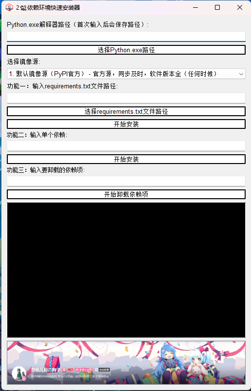
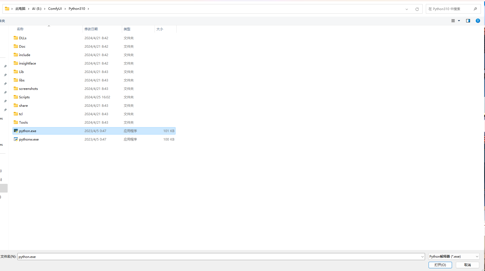
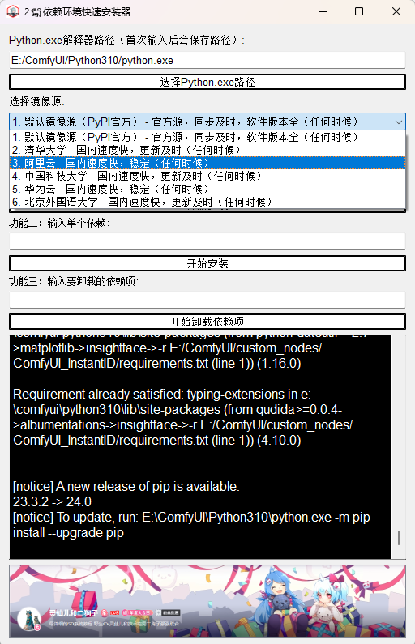
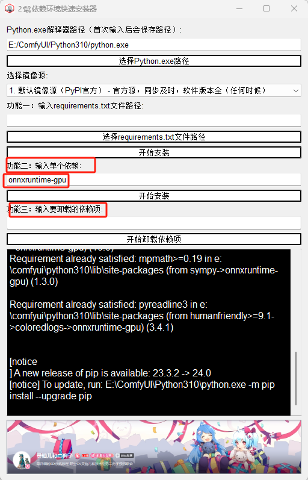

使用界面    
 

使用方式     
第一步：点击选择路径选择运行Comfyui的python路径找到python.exe    
     

第二步：选择需要安装的要求文件requirements.txt（通常它们在插件文件夹内）    
     

第三步：点击开始安装    
     

其它功能：可选安装使用的常用镜像    
     

其它功能：单个环境的安装与卸载    
     
